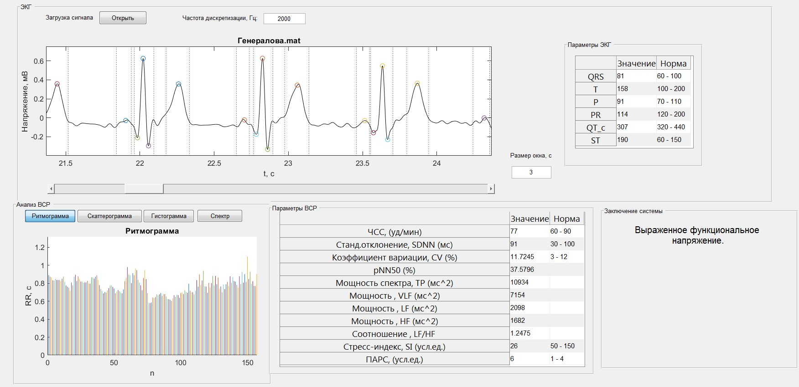

# Автоматизированная система анализа и интерпретации ЭКГ на основе вейвлет-преобразования

Оконное приложение для комплексного анализа ЭКГ на основе методики оценки вариабельности сердечного ритма. С помощью вейвлет-преобразования производится фильтрация необработанного сигнала ЭКГ и выделение всех основных ключевых точек волны сердечного сокращения. На их основе расчитываются основные показатели ВСРи другие параметры сигнала.

# Особенности
- Возможность выбора ширины окна просмотра ЭКГ-сигнала и перемещение по нему
- Выделение всех ключевых точек и интервалов кардиокомплекса
- Расчет основных показателей ВСР
- Построение диагностического заключения

# Результат работы
**_Окно программы_**

